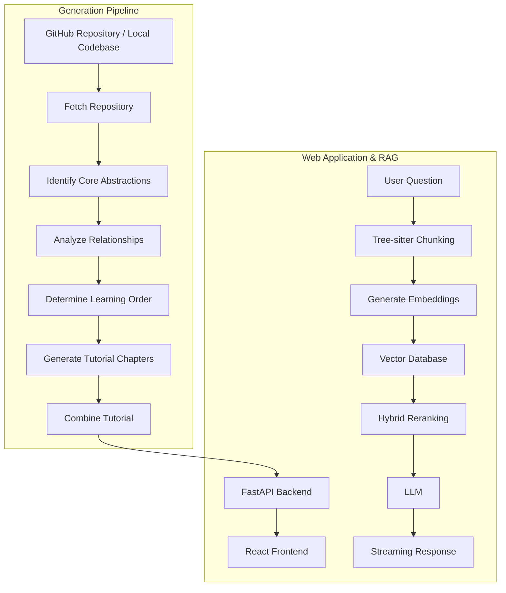
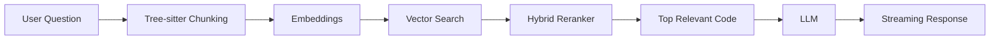

# 🚀 AI Codebase Knowledge Builder

> **Turn complex codebases into structured, beginner-friendly tutorials with AI.**

AI Codebase Knowledge Builder is an AI-powered platform that automatically analyzes a GitHub repository or local codebase and transforms it into a structured, multi-chapter learning experience.

The system uses **Tree-sitter for structure-aware code analysis**, an **agentic pipeline built with PocketFlow**, and **LLMs for reasoning and tutorial generation**. It also includes a **repository-aware RAG assistant** that allows users to ask questions about the codebase and receive context-aware answers.

---

## ✨ Features

* 🔗 Analyze public GitHub repositories or local codebases
* 🌳 Structure-aware code parsing using **Tree-sitter**
* 🧠 AI-powered identification of core abstractions and components
* 🔄 Automatic dependency and relationship analysis
* 📚 Generates a structured, multi-chapter tutorial
* 🗺️ Automatically determines a logical learning order
* 🤖 Repository-aware RAG chatbot
* 🔍 Semantic code retrieval and hybrid reranking
* 📊 Interactive dependency and architecture visualizations
* ⚡ Streaming AI responses
* 🔐 User authentication and dashboard support
* 💾 MongoDB Vector Search with in-memory fallback
* 📝 Syntax-highlighted code explanations and Markdown rendering

---

# 🏗️ Architecture

The system consists of two major workflows:

1. **AI Tutorial Generation Pipeline**
2. **Interactive Web Application & RAG Engine**



---

# 🔄 Tutorial Generation Pipeline

The project uses an agentic workflow built using **PocketFlow**.

```text
Repository
    ↓
Fetch Repository
    ↓
Identify Abstractions
    ↓
Analyze Relationships
    ↓
Order Chapters
    ↓
Generate Chapters
    ↓
Combine Tutorial
```

## 1. Fetch Repository

The system accepts:

* Public GitHub repository URLs
* Local codebase directories

It clones or scans the repository and filters relevant files while respecting:

* `.gitignore`
* Include/exclude patterns
* File size constraints

---

## 2. Identify Core Abstractions

The codebase is analyzed using an LLM to identify the most important concepts and components.

For example:

```text
Authentication System
Database Layer
API Routes
Business Logic
Frontend Components
Configuration
```

Each abstraction is mapped to the relevant files in the repository.

---

## 3. Analyze Relationships

The system determines how different components interact.

For example:

```text
Frontend
    ↓
API Routes
    ↓
Controllers
    ↓
Database
```

These relationships are later used to generate:

* Architecture diagrams
* Dependency graphs
* Learning order

---

## 4. Determine Learning Order

Instead of explaining files randomly, the system determines a logical learning sequence.

For example:

```text
Project Overview
    ↓
Entry Point
    ↓
Core Components
    ↓
Business Logic
    ↓
Database Layer
    ↓
Helper Utilities
```

This helps beginners understand the project progressively.

---

## 5. Generate Tutorial Chapters

Each abstraction is converted into a dedicated tutorial chapter.

A chapter may include:

* Concept explanation
* Relevant code snippets
* File references
* Mermaid diagrams
* Component relationships
* Execution flow

Example:

```text
Chapter 1 — Project Overview

Chapter 2 — Application Entry Point

Chapter 3 — Authentication System

Chapter 4 — API Architecture

Chapter 5 — Database Layer

Chapter 6 — Supporting Utilities
```

---

# 🌳 Structure-Aware Code Analysis

Traditional RAG systems often split code based on character or token limits.

This can result in:

```text
class UserService {

    ...

    // Chunk boundary ❌

    async createUser() {
```

The semantic meaning of the code may be lost.

Instead, this project uses **Tree-sitter AST parsing** to identify logical code boundaries.

```text
Source Code
    ↓
Tree-sitter AST
    ↓
Classes
Functions
Methods
Modules
    ↓
Semantic Code Chunks
```

This ensures that important structures remain intact before embedding and retrieval.

---

# 🤖 RAG Chat System

Users can ask questions about the repository.

Example:

```text
How does authentication work?

Where is the database connection initialized?

Explain the request flow.

Which files handle user registration?
```

The system retrieves relevant code before generating an answer.



---

# 🔍 Hybrid Retrieval & Reranking

The system combines semantic search with keyword relevance.

### Step 1: Vector Retrieval

Relevant code chunks are retrieved using vector similarity.

```text
User Query
    ↓
Embedding
    ↓
Vector Search
    ↓
Top Candidate Chunks
```

### Step 2: Hybrid Reranking

The candidates are reranked using both:

* Semantic cosine similarity
* TF-IDF keyword overlap

```text
Final Score =
0.6 × Semantic Similarity
+
0.4 × Keyword Relevance
```

This improves retrieval for both:

```text
Conceptual questions
```

and

```text
Exact code-related queries

Example:
MONGODB_URI
UserController
authenticateUser
```

---

# 🧠 Agentic Workflow

The tutorial generation process is divided into modular nodes.

```text
FetchRepo
    ↓
IdentifyAbstractions
    ↓
AnalyzeRelationships
    ↓
OrderChapters
    ↓
WriteChapters
    ↓
CombineTutorial
```

Each node:

* Performs a specific task
* Receives shared state
* Produces structured output
* Can validate results
* Can retry when generation fails

The shared state allows information to flow through the pipeline.

```python
shared = {
    "files": [],
    "abstractions": [],
    "relationships": [],
    "chapter_order": [],
    "chapters": []
}
```

---

# 🛠️ Tech Stack

## Backend

* **Python**
* **FastAPI**
* **Uvicorn**
* **PocketFlow**
* **Google GenAI SDK**
* **Ollama**
* **PyMongo**
* **MongoDB Atlas**
* **Tree-sitter**
* **GitPython**
* **Bcrypt**

## AI & RAG

* **Gemini**
* **Mistral**
* **Ollama**
* **Vector Embeddings**
* **MongoDB Atlas Vector Search**
* **TF-IDF**
* **Cosine Similarity**

## Frontend

* **React**
* **Vite**
* **React Flow**
* **Dagre**
* **Framer Motion**
* **Prism.js**
* **Marked.js**

---

# 🚀 Getting Started

## 1. Clone the Repository

```bash
git clone <your-repository-url>
cd <your-repository-name>
```

---

## 2. Create a Virtual Environment

```bash
python -m venv venv
```

Activate it.

### Windows

```bash
venv\Scripts\activate
```

### macOS / Linux

```bash
source venv/bin/activate
```

---

## 3. Install Dependencies

```bash
pip install -r requirements.txt
```

---

## 4. Configure Environment Variables

Create a `.env` file:

```env
GEMINI_API_KEY=your_api_key

MONGO_URI=your_mongodb_connection_string

OLLAMA_BASE_URL=http://localhost:11434
```

---

## 5. Run Ollama

Make sure Ollama is running locally.

Example models:

```bash
ollama pull mistral
```

For embeddings:

```bash
ollama pull nomic-embed-text
```

---

## 6. Run the Backend

```bash
uvicorn server:app --reload
```

---

## 7. Run the Frontend

```bash
cd frontend
npm install
npm run dev
```

---

# 💬 Example Usage

### Input

Paste a public GitHub repository:

```text
https://github.com/user/project
```

### The System Will

```text
1. Clone the repository
2. Analyze the project structure
3. Extract important abstractions
4. Detect relationships
5. Determine the best learning order
6. Generate tutorial chapters
7. Create architecture visualizations
8. Index the repository for RAG
9. Enable repository-aware chat
```

---

# ⚡ Handling LLM Failures

LLM-generated outputs are validated before being used.

The system uses:

```text
Structured Outputs
        +
Schema Validation
        +
Retry Mechanism
        +
Caching
```

Example:

```text
LLM Response
    ↓
Validate Structure
    ↓

Valid? ─── Yes ──→ Continue

   │
   No

   ↓

Retry Node
```

This helps reduce failures caused by:

* Invalid indexes
* Missing fields
* Incorrect YAML structure
* Unexpected LLM output

---

# 📊 Visualizations

The application can visualize codebase relationships using interactive graphs.

Features include:

* Draggable nodes
* Dependency graphs
* Component relationships
* Automatic graph layouts
* Architecture visualization

Example:

```text
Frontend
    │
    ├── API Client
    │
    ▼
Backend
    │
    ├── Authentication
    ├── Business Logic
    └── Database
```

---

# 🎯 Problem Statement

Understanding an unfamiliar codebase is difficult.

Developers often need to:

```text
Read hundreds of files
        ↓
Trace dependencies
        ↓
Understand architecture
        ↓
Identify entry points
        ↓
Search documentation
        ↓
Ask other developers
```

This project automates much of that onboarding process.

```text
Repository
    ↓
AI Analysis
    ↓
Architecture Understanding
    ↓
Structured Learning Path
    ↓
Interactive Tutorial
    ↓
Repository-Aware Assistant
```

---

# 🔮 Future Improvements

* [ ] Support private repositories
* [ ] Multi-language codebase support
* [ ] GitHub OAuth integration
* [ ] Incremental repository indexing
* [ ] Better dependency analysis
* [ ] Multi-agent verification pipeline
* [ ] Tutorial export as PDF
* [ ] Collaborative learning workspaces
* [ ] Code execution sandbox
* [ ] Personalized learning paths
* [ ] Automatic documentation generation

---

# 🎓 Key Learnings

This project explores:

* Agentic AI workflows
* Retrieval-Augmented Generation
* Semantic code understanding
* Abstract Syntax Tree parsing
* Vector databases
* Hybrid retrieval
* LLM output validation
* Streaming AI responses
* AI-powered developer onboarding

---

# 👨‍💻 Author

**Harshit Jain**

Software Engineering Student | AI & Full Stack Developer

---

## ⭐ If You Like This Project

Consider giving the repository a **star** ⭐

It helps others discover the project!
