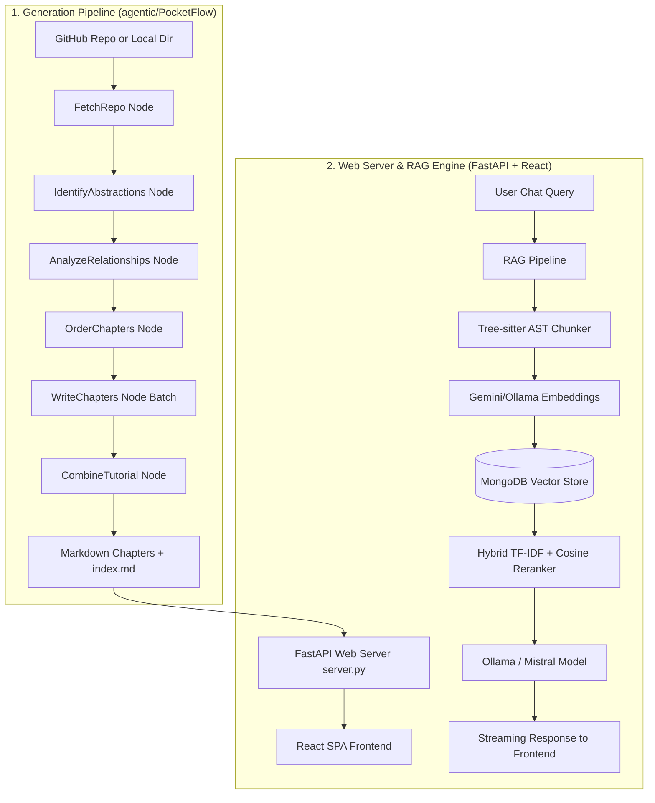

# Interview Preparation Guide: AI Codebase Tutorial Builder & RAG Assistant

This guide provides a comprehensive roadmap, system architecture explanation, tech stack summary, and interview preparation material for the **AI Codebase Tutorial Builder**.

---

## 1. Project Elevator Pitch (The 30-Second Summary)
> "This project is an **AI-driven knowledge builder and interactive RAG assistant** that solves the 'developer onboarding problem.' It ingests any public GitHub repository or local codebase, semantically parses it using Tree-sitter AST parser, runs it through an structured agentic pipeline using a 100-line framework named **PocketFlow**, and auto-generates a clean, beginner-friendly multi-chapter tutorial. Finally, it serves this tutorial through a sleek, premium React+FastAPI web application equipped with a repository-aware chat assistant that supports streaming chat and semantic code visualizers."

---

## 2. Core Architecture & System Design

The system is composed of two primary workflows: **The Generation Pipeline** and **The Interactive Web & RAG Engine**.

---

## 3. Technology Stack & Key Libraries

### **Backend Core & Agentic Flow**
*   **PocketFlow**: A lightweight, 100-line agentic framework. It structures code execution into modular **Nodes** passing a **shared state dictionary** (`shared`).
*   **Google GenAI SDK**: Primarily utilizes **Gemini 2.5 Pro** (`gemini-2.5-pro-exp-03-25`) to handle complex code reasoning, abstraction mapping, and writing tutorial explanations.
*   **GitPython & pathspec**: Handles git cloning and file glob matching (`.gitignore` rules) during code ingestion.
*   **Tree-sitter**: Extracts classes, functions, and method declarations to generate clean, logical syntax-boundary chunks.

### **Web Server & Database (RAG)**
*   **FastAPI & Uvicorn**: Hosts the backend REST APIs and serves compiled frontend assets.
*   **PyMongo / MongoDB Atlas**: Stores indexed code chunks and enables **Vector Search** queries. Implements an automatic in-memory mock fallback if MongoDB is not present locally.
*   **Ollama / Mistral**: Power local vector embedding generation (`nomic-embed-text`) and streaming codebase chat interactions (e.g., `mistral`).
*   **Bcrypt**: Used for user registration, hashing, and authentication for logging into the dashboard.

### **Frontend & Visualizations**
*   **React + Vite**: A lightning-fast, modular SPA structure compiled and written straight into `/static` for production serving.
*   **ReactFlow & Dagre**: Generates physics-based, interactive, and draggable visual diagrams mapping component relationships.
*   **Framer Motion**: Delivers seamless glassmorphic transitions and sleek volumetric glowing auroras.
*   **Prism.js & Marked.js**: Powers real-time markdown translation and syntax-highlighted code block views.

---

## 4. Node-by-Node Pipeline Walkthrough

The generation sequence inherits from `Flow` in [flow.py](file:///c:/Users/HP/ai_knowledge_codebase/PocketFlow-Tutorial-Codebase-Knowledge/flow.py) and executes the following steps sequentially in [nodes.py](file:///c:/Users/HP/ai_knowledge_codebase/PocketFlow-Tutorial-Codebase-Knowledge/nodes.py):

1.  **`FetchRepo(Node)`**:
    *   *Input*: URL of a public repository or a local directory path.
    *   *Process*: Clones or scans directory contents. Filters files against include/exclude patterns and file size constraints.
    *   *Output*: Returns a list of `(path, content)` file tuples stored in `shared["files"]`.
2.  **`IdentifyAbstractions(Node)`**:
    *   *Process*: Packs files and feeds them into the LLM, prompting it to identify 5–10 core abstractions (along with simple analogies and file references).
    *   *Output*: Returns a YAML list containing `name`, `description`, and matching `file_indices`.
3.  **`AnalyzeRelationships(Node)`**:
    *   *Process*: Provides the LLM with the abstractions list and relevant file contents. It returns a main project summary and specifies relationship edges (`from`, `to`, `label`) connecting the abstractions.
    *   *Output*: Stores the connectivity graph in `shared["relationships"]`.
4.  **`OrderChapters(Node)`**:
    *   *Process*: Prompt-engineers the LLM to sort abstractions in a logical pedagogical sequence (foundational concepts and entry points first, followed by helper logic and lower-level classes).
    *   *Output*: An ordered list of indices saved in `shared["chapter_order"]`.
5.  **`WriteChapters(BatchNode)`**:
    *   *Process*: A parallelized batch processor that compiles individual chapters concurrently. Prompts the LLM to construct a beginner-friendly tutorial for each abstraction using code blocks under 10 lines, Mermaid flowcharts, and sequence diagrams.
    *   *Output*: Saves the list of markdown strings in `shared["chapters"]`.
6.  **`CombineTutorial(Node)`**:
    *   *Process*: Creates `index.md` showing an overall overview, dynamically builds a main Mermaid dependency chart mapping the abstractions, and saves all markdown files in the `./output/<project-name>` directory.

---

## 5. RAG & Chat Pipeline (Deep Dive)

When a user opens a project and asks a question in the chat interface:
1.  **Semantic Chunking**: Code files are broken down using **Tree-sitter AST parser** to isolate logical boundaries (classes and function scopes) rather than using arbitrary word counts.
2.  **Vector Embeddings**: Chunks are embedded using `text-embedding-004` (Gemini) or a local Ollama embedding model (`nomic-embed-text`).
3.  **Hybrid Reranking**:
    *   First, retrieves top 25 candidates using Atlas Vector Search (or in-memory cosine fallback).
    *   Applies a **hybrid overlap density reranker** calculating terms overlap:
        $$\text{Combined Score} = (0.6 \times \text{Semantic Cosine Similarity}) + (0.4 \times \text{TF-IDF Word Overlap Density})$$
    *   Selects the top 6 highest-scoring chunks.
4.  **Generation**: Injects the top 6 chunks into a system prompt template and streams the response to the user via **FastAPI StreamingResponse** from the local Ollama Mistral model.

---

## 6. Likely Interview Questions & Sample Answers

#### **Q: Why did you choose a custom framework like PocketFlow instead of LangChain or AutoGen?**
> *"LangChain and AutoGen are highly powerful, but they bring massive overhead and make tracking state transitions difficult. PocketFlow is a minimal, transparent framework that operates like a state machine. It passes a shared dictionary between isolated, testable nodes. This makes debugging easy, lets us validate outputs at each node, and gives us deterministic control over the execution order while keeping our codebase lightweight."*

#### **Q: What is Tree-sitter, and why is it superior to character-limit chunking in RAG?**
> *"Character or word-based chunking often splits code in the middle of a class definition, variable declaration, or loop, destroying semantic context. We map file extensions to Tree-sitter parsers to extract code boundaries logically. Chunks correspond exactly to function declarations or class bodies, which ensures that helper methods are kept whole and the embedding models receive clean, logically complete segments."*

#### **Q: How does the system handle LLM hallucination and invalid outputs?**
> *"We use structured YAML schemas inside the LLM prompt instructions and parse the returned strings using standard parser libraries. If the LLM generates a missing property or invalid indexes (e.g. an index higher than the file count), the Node code throws a `ValueError`. Because our PocketFlow framework supports retry parameters (`max_retries=5`), the pipeline automatically retries the failed node. The system also caches successful requests in `llm_cache.json` to prevent re-billing for nodes that passed successfully."*

#### **Q: Explain the hybrid reranker. Why not just use Cosine Similarity?**
> *"Vector search is great at capturing overall semantic meaning (e.g., matching 'database storage' to 'saving records'). However, it can struggle with exact keyword lookups like specific class names or configuration keys (e.g., 'MONGODB_URI'). Our reranker combines the cosine vector score (60% weight) with keyword term overlap density (40% weight). This brings the most syntactically and semantically relevant pieces of code into the 6-chunk context window."*

#### **Q: How does the FastAPI server work when MongoDB is not installed?**
> *"To ensure a seamless developer setup and ease of testing, the backend features a robust mock-fallback database helper in `server.py`. If the connection to MongoDB fails or times out, the server falls back to an in-memory dictionary-based object mock. The RAG pipeline likewise switches to a NumPy-based in-memory cosine similarity search so that the web features function perfectly even without a database cluster running."*

